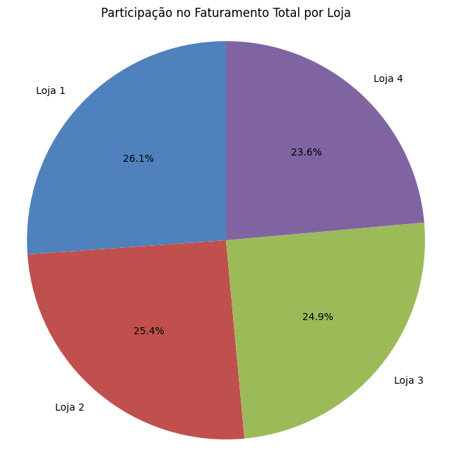

# 📊 Desafio Alura Store – Análise de Dados com Python

Este repositório apresenta a solução do desafio de análise de dados do e-commerce Alura Store. O objetivo é apoiar o Sr. João, proprietário de uma rede de quatro lojas, a decidir qual unidade vender para investir em um novo negócio, utilizando análise de dados e visualização com Python.

---

## 🚀 Objetivo

Aplicar conceitos de análise e visualização de dados para identificar, com base em métricas reais, qual loja apresenta o menor desempenho e deve ser vendida. O projeto utiliza bibliotecas nativas do Python e ferramentas amplamente usadas em ciência de dados.

---

## 🗂️ Conteúdo do Projeto

- **Importação e preparação dos dados** das quatro lojas.
- **Análise de faturamento:** comparação do faturamento total de cada loja.
- **Categorias mais vendidas:** identificação das categorias de maior volume de vendas.
- **Avaliação dos clientes:** cálculo da média de avaliação de cada loja.
- **Produtos mais e menos vendidos:** destaque dos itens de melhor e pior desempenho em vendas.
- **Frete médio:** comparação dos custos médios de frete por loja.
- **Visualização de dados:** gráficos informativos para cada métrica analisada.
- **Relatório final:** recomendação baseada em dados sobre qual loja vender.

---

## 📈 Principais Resultados

- **Loja 4** apresenta o menor faturamento, avaliações medianas e não possui diferenciais relevantes em produtos ou categorias.
- Recomenda-se a venda da **Loja 4** para que o Sr. João possa investir de forma mais estratégica em novos negócios.

---

## 🛠️ Tecnologias Utilizadas

- Python (Pandas, Matplotlib)
- Google Colab

---

## ▶️ Como Executar

1. Clone este repositório.
2. Abra o notebook principal (`AluraStore_Analise.ipynb`) no Google Colab ou Jupyter Notebook.
3. Execute as células para reproduzir as análises e gráficos.
4. Certifique-se de que os arquivos de dados estejam no mesmo diretório do notebook.

---

## 🖼️ Exemplos de Gráficos

### Faturamento Total

Gráfico de barras destacando o produto com maior número de vendas em cada loja, mostrando os itens de maior sucesso comercial.

### Frete Médio por Loja

Gráfico de barras comparando o valor médio do frete cobrado em cada loja, importante para análise de custos logísticos.

### Média de Avaliações

Gráfico de barras exibindo a média das avaliações dos clientes para cada loja, indicando o nível de satisfação do consumidor.

### Produto Mais Vendido

Gráfico de barras destacando o produto com maior número de vendas em cada loja, mostrando os itens de maior sucesso comercial.

### Produto Menos Vendido

Gráfico de barras mostrando o produto com menor número de vendas em cada loja, útil para identificar itens com baixo desempenho.

### Vendas por Categoria - Loja 1

Gráfico de barras das categorias de produtos mais vendidas na Loja 1, revelando o perfil de consumo dos clientes.

### Vendas por Categoria - Loja 2

Gráfico de barras das categorias de produtos mais vendidas na Loja 2, revelando o perfil de consumo dos clientes.

### Vendas por Categoria - Loja 3

Gráfico de barras das categorias de produtos mais vendidas na Loja 3, revelando o perfil de consumo dos clientes.

### Vendas por Categoria - Loja 4

Gráfico de barras das categorias de produtos mais vendidas na Loja 4, revelando o perfil de consumo dos clientes.

> **Com base nas análises quantitativas e visuais, a Loja 4 foi recomendada para venda por apresentar o menor desempenho financeiro e operacional entre as quatro unidades analisadas.**

---

## 📬 Contato

Dúvidas ou sugestões? Entre em contato pelo [[LinkedIn](https://www.linkedin.com/in/tabatagonzales/)].

Copyright (c) 2025 **[Tabata Gonzales]**

